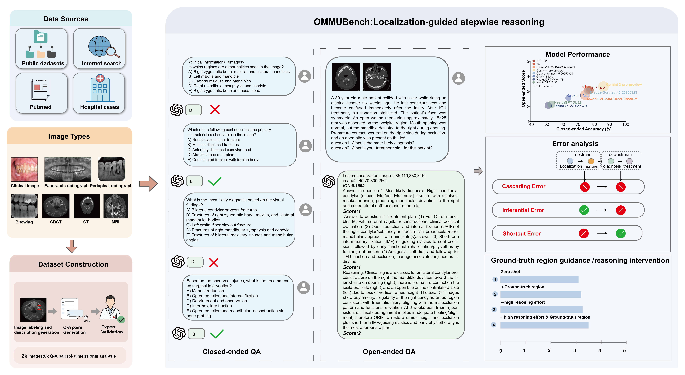

# OMMUBench
<div align="center">



</div>

---

## 🔬 Overview

OMMUBench focuses on verifying whether models follow a clinical reasoning chain that proceeds from lesion localization and feature interpretation to diagnosis and treatment.

It comprises:
- 7 imaging modalities  
- 6 major disease categories  
- 5756 closed-ended questions  
- 2878 open-ended questions  

We evaluate a wide range of state-of-the-art multimodal foundation models, including Gemini-3-pro-preview, GPT-5.2, o3, and others.

---

## 🚀 How to Use

### 1. Prepare API Credentials
Prepare API keys for evaluated LVLMs (GPT, Gemini, Claude, Qwen, etc.).In the inference module, modify the corresponding constants in the source code according to your service provider and API configuration.
For example:
```python id="gpt_cfg"
OPENAI_API_KEY=
OPENAI_API_BASE=
```
---

### 2. Configure Models & Judge
- Set model endpoints in configuration files  
- Configure LLM-based judge for open-ended evaluation  
- Define output parsing format for all tasks  

---

### 3. Run Evaluation
OMMUBench is constructed from multiple datasets. Open-access datasets can be obtained from the following links:
- [Instance_seg_teeth](https://github.com/devichand579/Instance_seg_teeth)
- [Caries detection](https://universe.roboflow.com/jj-zi0hr/caries-l2wej)
- [Mouth and oral diseases](https://www.kaggle.com/datasets/javedrashid/mouth-and-oral-diseases-mod)
Restricted-access datasets are available upon request at tzhdent@163.com.

Evaluation consists of three stages:
- Closed-ended VQA evaluation (accuracy)
- Open-ended VQA evaluation (Likert scoring)
- Lesion localization evaluation (IoU)

---

## 📊 Evaluation Leaderboard

### Closed-ended VQA

| Model | DPD | DSTD | SMD | CD | SGD | BD | Overall |
|------|-----|------|-----|----|-----|----|--------|
| GPT-5.2 | 68.57 | 79.82 | 81.92 | 83.97 | 84.78 | 78.74 | 77.26 |
| o3 | 68.28 | 80.04 | 81.80 | 70.34 | 86.96 | 79.70 | 76.08 |
| Qwen3-VL-235B-A22B-Instruct | 64.66 | 79.17 | 81.13 | 74.48 | 80.43 | 76.22 | 74.25 |
| Gemini-3-pro-preview | 79.50 | 86.84 | 90.96 | 91.03 | 83.70 | 85.33 | 85.86 |
| Claude-Sonnet-4-5-20250929 | 69.33 | 76.97 | 79.98 | 87.76 | 83.70 | 73.48 | 75.92 |
| Grok-4-1-fast | 54.09 | 71.05 | 68.51 | 63.62 | 83.70 | 67.33 | 63.85 |
| HuatuoGPT-Vision-7B | 38.14 | 53.51 | 52.61 | 51.90 | 52.17 | 64.94 | 51.16 |
| HealthGPT-XL32 | 42.23 | 67.11 | 47.94 | 62.93 | 71.74 | 64.44 | 53.13 |

---

### Open-ended VQA

| Model | DPD | DSTD | SMD | CD | SGD | BD | Overall |
|------|-----|------|-----|----|-----|----|--------|
| GPT-5.2 | 2.65 | 3.57 | 3.39 | 2.68 | 4.29 | 3.46 | 3.09 |
| o3 | 2.62 | 3.61 | 3.49 | 2.86 | 4.03 | 3.42 | 3.11 |
| Qwen3-VL-235B-A22B-Instruct | 2.50 | 3.04 | 2.91 | 2.63 | 3.68 | 2.98 | 2.76 |
| Gemini-3-pro-preview | 2.99 | 3.50 | 3.61 | 3.33 | 3.91 | 3.45 | 3.33 |
| Claude-Sonnet-4-5-20250929 | 2.56 | 3.57 | 3.37 | 2.73 | 3.93 | 3.20 | 3.01 |
| Grok-4-1-fast | 2.21 | 2.92 | 2.79 | 2.41 | 3.78 | 2.80 | 2.57 |
| HuatuoGPT-Vision-7B | 1.86 | 1.99 | 2.20 | 2.11 | 3.00 | 2.26 | 2.08 |
| HealthGPT-XL32 | 1.91 | 2.32 | 2.03 | 2.33 | 3.61 | 2.52 | 2.14 |

---

### Lesion Localization (IoU)

| Model | DPD | DSTD | SMD | CD | SGD | BD | Overall |
|------|-----|------|-----|----|-----|----|--------|
| GPT-5.2 | 0.16 | 0.21 | 0.39 | 0.15 | 0.05 | 0.14 | 0.22 |
| o3 | 0.15 | 0.16 | 0.38 | 0.16 | 0.15 | 0.14 | 0.22 |
| Qwen3-VL-235B-A22B-Instruct | 0.21 | 0.08 | 0.54 | 0.32 | 0.09 | 0.13 | 0.30 |
| Gemini-3-pro-preview | 0.23 | 0.30 | 0.52 | 0.27 | 0.29 | 0.28 | 0.33 |
| Claude-Sonnet-4-5-20250929 | 0.08 | 0.15 | 0.36 | 0.22 | 0.11 | 0.12 | 0.19 |
| Grok-4-1-fast | 0.10 | 0.05 | 0.31 | 0.16 | 0.04 | 0.07 | 0.16 |
| HuatuoGPT-Vision-7B | 0.11 | 0.09 | 0.37 | 0.23 | 0.04 | 0.07 | 0.19 |
| HealthGPT-XL32 | 0.12 | 0.03 | 0.44 | 0.27 | 0.01 | 0.04 | 0.21 |

---

## 📬 Contact

If you have any question, please feel free to contact tzhdent@163.com

---

## 📚 Citation

If you use OMMUBench, please cite:

@misc{ommubench2026,
  title={OMMUBench: evaluating clinical reasoning of large vision-language models in oral and maxillofacial disease analysis},
  author={Zihui Tang, Chang Liu, Yutao Xiong, Wei Tang},
  year={2026},
  url={https://github.com/TZH-L/OMMUBench}
}
  

